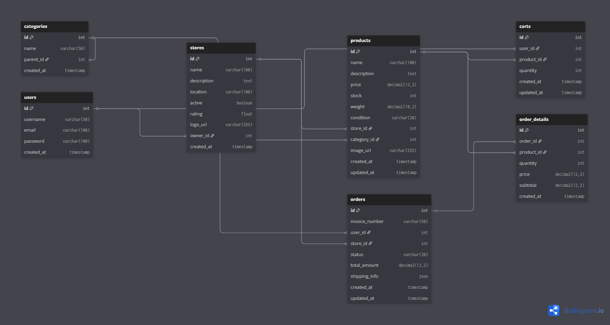

# E-Commerce System - Magang Project

## 🧠 Teori

### 1. Apa yang Anda ketahui tentang REST API?

REST API (Representational State Transfer) adalah arsitektur komunikasi berbasis HTTP yang memungkinkan client dan server berkomunikasi secara stateless menggunakan metode HTTP seperti GET, POST, PUT, DELETE. Data biasanya ditransfer dalam format JSON. REST API umum digunakan dalam aplikasi web dan mobile.

### 2. Apa yang Anda ketahui tentang Server-side dan Client-side Processing?

- **Server-side processing**: Proses yang dijalankan di server, seperti validasi data, manipulasi database, dan autentikasi. Contoh: Spring Boot, Laravel.
- **Client-side processing**: Proses yang dijalankan di browser pengguna, seperti rendering tampilan dan validasi form sederhana. Contoh: React.js, Vue.js.

### 3. Apa yang Anda ketahui tentang Monolith dan Microservices?

- **Monolith**: Seluruh fitur dan komponen dalam satu aplikasi besar. Cocok untuk aplikasi kecil-menengah. Contoh: Aplikasi toko online sederhana berbasis Spring Boot tunggal.
- **Microservices**: Setiap fitur dibagi menjadi layanan terpisah yang saling terhubung melalui API. Cocok untuk aplikasi skala besar dan tim besar. Contoh: Service auth, product, dan order terpisah.

### 4. Apa yang Anda ketahui tentang Design Pattern Inversion of Control dan Dependency Injection?

- **Inversion of Control (IoC)** adalah prinsip di mana pengambilan kendali pembuatan dan manajemen objek diserahkan pada framework, bukan dibuat manual.
- **Dependency Injection (DI)** adalah salah satu cara implementasi IoC, di mana dependency (misal service atau repository) diberikan oleh framework (Spring) ke dalam class yang membutuhkannya. Ini meningkatkan modularitas dan testability.

### 5. Apa yang Anda ketahui tentang Java Programming dan Spring Framework, khususnya Spring Boot?

Java adalah bahasa OOP yang populer, kuat, dan digunakan secara luas dalam pengembangan enterprise application.  
Spring Boot adalah framework berbasis Java yang memudahkan pembuatan aplikasi berbasis Spring dengan konfigurasi minimal dan dependency management otomatis. Cocok untuk membuat REST API dengan cepat dan efisien.

---

## 🧱 Desain Sistem

### 1. Desain Database

Entity utama:

- **Toko**: Menyimpan info toko (id, nama, alamat)
- **Barang**: Produk yang dijual (id, nama, harga, stok, id_toko)
- **Pembelian**: Transaksi yang dilakukan (id, id_barang, jumlah, total_harga, tanggal)

### 2. ERD (Entity Relationship Diagram)

### 2. Arsitektur Modul: Monolith

#### Alasan:

- Proyek ini berskala kecil-menengah dan dikerjakan oleh 1 tim kecil.
- Penggunaan monolith mempermudah koordinasi, integrasi, dan debugging.

## 🏗️ Arsitektur Aplikasi

### Layer Architecture (Spring Boot)

#### 1. **Controller Layer**

- Menangani HTTP requests dan responses
- Validasi input dasar
- Mapping endpoint ke service methods

#### 2. **Service Layer**

- Business logic dan validasi bisnis
- Orchestration antar repository
- Transaction management

#### 3. **Repository Layer**

- Data access menggunakan JPA/Hibernate
- Query ke database MySQL
- CRUD operations

#### 4. **Entity Layer**

- JPA entities yang mapping ke database tables
- Relasi antar entities (@OneToMany, @ManyToOne)

#### 5. **DTO Layer**

- Data Transfer Objects untuk API requests/responses
- Memisahkan struktur database dari API contract
- Validasi menggunakan Bean Validation
